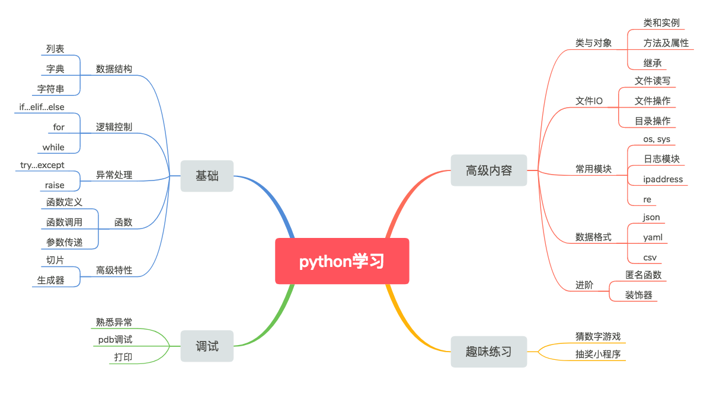

# 第一部分

Python学习包括数据结构、逻辑控制、调试及异常、类和一些高级特性。

由于工作中很少用到，本章内容将不包含一些高级特性（如装饰器、匿名函数及多线程等），如有兴趣，可自行学习掌握。

> #### success::组织讨论
>
> **建议每两周组织必要的讨论，分享彼此的实现逻辑，学习相关知识点**

* 第一周
    * [练习1-列表](1.md)
    * [练习2-字典](2.md)
    * [练习3-数据结构嵌套](3.md)

* 第二周
    * [练习4-运算符](4.md)

* 第三周
    * [练习5-逻辑控制](5.md)
    * [练习6-异常处理](6.md)

* 第四周
    * [练习7-函数](7.md)
    * [练习8-文件操作](8.md)

* 第五周
    * [轻松一刻-猜数字游戏](happy1.md)

* 第六周-第七周
    * [练习9-类.1](9.md)
    * [练习10-类.2](10.md)
    * [练习11-类的继承](11.md)

* 第八周
    * [练习12-pdb调试](12.md)
    * [轻松一刻-抽奖小程序](happy2.md)